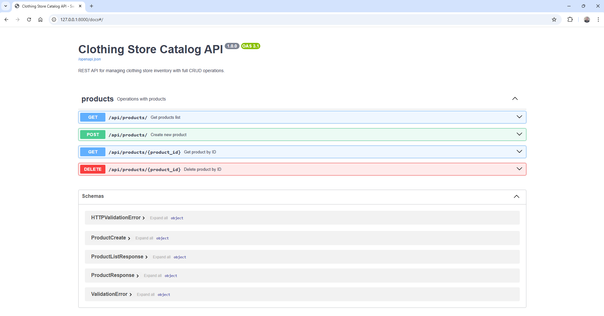

# Clothing Store API

Асинхронное REST API приложение для интернет-магазина одежды, построенное на FastAPI с использованием PostgreSQL и SQLAlchemy ORM.

## 🚀 Функциональность
- **CRUD** для управления товарами
- **Валидация данных** с помощью Pydantic v2
- **Автоматическая документация** Swagger/OpenAPI

## 🔧 Технологии
- **FastAPI** - асинхронный веб-фреймворк
- **PostgreSQL** - реляционная база данных
- **SQLAlchemy** - ORM для работы с базой данных
- **Docker** - контейнеризация приложения
- **Pydantic v2** - валидация и сериализация данных
- **Pytest** - фреймворк для тестирования

## 📦 Установка и запуск

### Клонирование репозитория
```bash
git clone <repository-url>
cd <project-directory>
```

### Конфигурация
Переименуйте файл `.env.example` в `.env` и заполните его актуальными данными

### Запуск приложения через `docker-compose`
#### Предварительные требования
- Docker
- Docker Compose
- Git

```bash
docker-compose up --build
```

#### Остановка приложения
```bash
docker-compose down
```

## 📚 Использование

### Документация и тестирование API

После запуска приложения документация и тестирование доступно по адресу:

- Swagger UI: http://localhost:8000/docs

<p align="center"></p>

## 📁️ Структура проекта
```
app/
├── app/
│   ├── api/           # Эндпоинты API
│   ├── core/          # Основная конфигурация и зависимости
│   ├── db/            # Модели ORM
│   ├── schemas/       # Pydantic модели
│   ├── services/      # Бизнес-логика>
│   └── main.py        # FastAPI приложение
├── docker-compose.yml
└── Dockerfile
```

## ♻️ Комментарии
Если Категории товаров выделить в отдельную таблицу, то можно получить ряд приимуществ:  
- **Целостность данных** - исключает опечатки в названиях категорий ("T-Shirt" vs "T-shirt" vs "TShirt")
- **Экономия памяти** - храним ID (4 байта) вместо строк (до 100 байт) в каждой записи товара
- **Простота изменений** - переименование категории делается в одном месте
- **Дополнительные поля** - можно добавить описание категории, slug, изображение, порядок сортировки
- **Производительность** - JOIN по integer ключу обычно быстрее чем WHERE по текстовому полю
- **Масштабируемость** - легко добавить древовидную структуру категорий

## 📝 Лицензия
Этот проект лицензирован под MIT License - смотрите файл LICENSE для деталей

## 🤝 Поддержка
Для вопросов и поддержки обращайтесь через Issues в репозитории проекта
